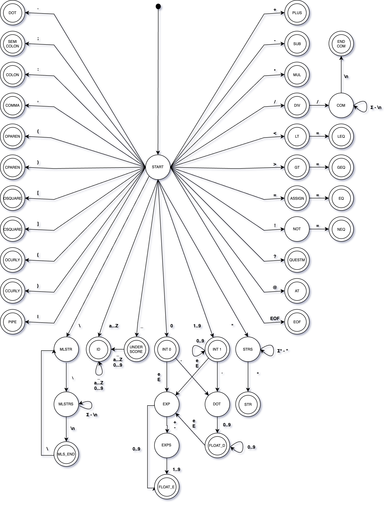

# IFJ group project
The goal of this project is to implement a compiler for an **IFJ24** language similar to **Zig**.

Main parts:
- **Scanner** generating tokens, implemented in accordance with the designed finite state machine 
- **Parser** generating abstract syntax tree, implemented in accordance with the LL(1) grammar
- **Symbol table** saving information about variables and functions, implemented using hashtable with an open addressing method of collision resolution
- **Code generator** doing abstract syntax tree traversal and generating three-address code for given interpret `ic24int`
- **Auxiliary data structures and algorithms:** stack, string, abstract syntax tree, dynamic array and memory allocation management

# Compilation flow

  

1. Scanner receives a **code in IFJ24 language** and returns an **array of tokens**
2. Parser generates **abstract syntax tree** from **tokens** and interacts with symbol table
3. Code generator receives **abstract syntax tree** and generates **three-address code**

# Abstract syntax tree

  

- **Red** shape contains main node, which contains all function nodes
- **Green** shape contains body node for functions and flow control statements, which contains general node for statements
- **Blue** shape contains nodes for all implemented statements

# FSM and LL table

  

  

# Official test results
Lexical analysis (error detection): 91 % (192/210 mb)  
Syntactic analysis (error detection): 89 % (240/267 mb)  
Semantic analysis (error detection): 94 % (380/402 mb)  
Interpretation of translated code (basic): 90 % (327/360 mb)  
Interpretation of translated code (expressions, built-in functions): 95 % (162/170 mb)  
Interpretation of translated code (complex): 69 % (293/421 mb)  

FUNEXP 70 % (106/150 mb)

Total without extensions: 87 % (1594/1830 mb)